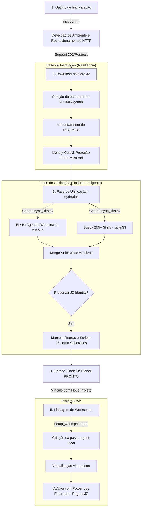

# 📊 Fluxograma Cronológico de Operação - Antigravity Kit (JZ Edition)

Este documento descreve a linha do tempo exata, desde o comando inicial até a ativação da IA em um projeto.

---

## 1. Fluxo Cronológico (Lifecycle)

---

## 2. Detalhamento dos Estágios

### Estágio 1: O Gatilho e a Rede
Tudo começa com o comando de uma linha. O instalador agora é inteligente: ele detecta redirecionamentos do GitHub (302), possui timeouts de segurança (60s) e fornece feedback visual constante para garantir que a instalação não "trave" silenciosamente.

### Estágio 2: A Fundação (Zero-Dependency & Resiliência)
Nesta fase, o instalador cria a estrutura de diretórios e extrai o "cérebro" do sistema. O mecanismo **Identity Guard** entra em ação: ele garante que o seu `GEMINI.md` personalizado e os scripts de portabilidade sejam instalados como arquivos protegidos. A lógica ignora nomes de pastas dinâmicas, garantindo que o kit funcione em qualquer máquina desde a primeira execução.

### Estágio 3: A Unificação (Update Inteligente)
O script `sync_kits.py` realiza um upgrade modular:
1. Ele busca a orquestração de agentes (vudovn) e a biblioteca massiva de habilidades (sickn33).
2. **Merge Seletivo**: O script injeta as novas habilidades nas pastas correspondentes, mas possui um "firewall" lógico que **impede a sobrescrita** da identidade JZ Edition (regras globais e scripts de linkagem).

### Estágio 4: O Kit Global Protegido
Agora a máquina tem o equilíbrio perfeito: o poder bruto das ferramentas originais com a inteligência e personalização do **JZ Edition** preservadas. Tudo centralizado no `$HOME`.

### Estágio 5: Ativação no Projeto
Ao iniciar um código novo:
- O `setup_workspace.ps1` vincula o projeto local à instalação global.
- A IA lê o `GEMINI.md` (protegido durante o sync) e o kit é ativado.
- **Resultado:** Suas personalizações e regras socráticas funcionam em conjunto com centenas de habilidades externas.

---

## 3. Resultado Final
Ao final deste fluxo, o usuário tem um assistente de IA que:
- Segue as regras do **JZ Edition**.
- Possui o conhecimento das **250+ Skills**.
- É **100% resiliente a rede e ambiente**.
- Possui **instalação assistida com feedback de progresso**.
